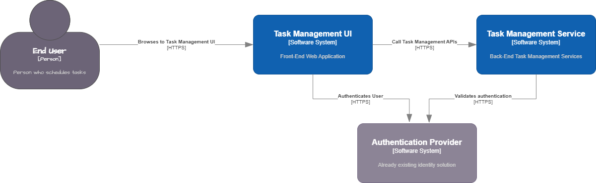
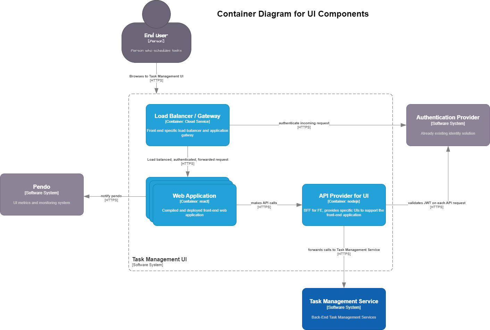
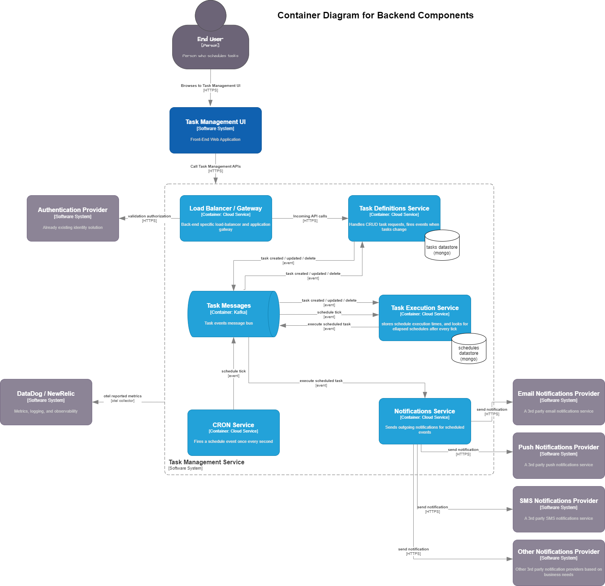

# Architecture and Design for Distributed Task Scheduler

A hypothetical exercise to design a distributed task scheduler.

## Overview / Problem Statement

End users need a way to reliably schedule personal tasks (either one-time, or recurring) and receive notifications when the task is scheduled to start. Use cases are calendar reminders, cron-style recurring events, and sending scheduled notifications to end-users (such as appointment reminders.)

### Requirements / Use Cases

### Out of Scope

* This system is not a task or job runner. It does not execute jobs. It simply records scheduled future tasks and notifies when the execution of those tasks are due to start.
* Public API access -- this system is meant to be used by humans through a user-interface. The use-cases are all human-focused use cases (calendars, reminders, and notifications.)

### Assumptions / Prerequisites / Dependencies / Known Issues

* Assumed that contracts and legal agreements are in-place.
* Assumed that this is part of a larger system where user details and authentication methods already exists. The design will specify how to integrate with existing authentication and authorization systems.
* Assumed that network ingress, transit gateways, firewalls, and other network infrastructure is in-place. This design will begin at a system API gateway ingress.

## Solution Description

At a high-level, this system uses an event-sourced, globally redundant, cloud-agnostic, architecture to provide guaranteed notifications of upcoming scheduled tasks.



The solution consists of two main software systems:

* the front-end web application, written in React, with a BFF (backend for frontend) supporting service
* the back-end services that handle the storing, scheduling, and outgoing notifications for the tasks

### Front-End Design



The front-end system consists of 3 main containers/services that can be developed independently:

* An API gateway, ingress, that handles validating authorization headers, and load balancing among multiple instances of the UI API Provider
* A UI API Provider that is the backend for frontend service, exposing UI-specific API endpoints for the UI to call, and proxying them to the Task Management Service system (calling that system's APIs)
* A static, react-based web application served via a CDN or similar solution

The already existing authentication provider is used to validation end-user requests. Pendo is used to provide UI-level observability and metrics.

### Application Design

The Task Management Service is an event-driven notification system that uses Kafka as the message bus, mongo as the primary datastore for tasks and schedules, and exposes API endpoints via a load-balanced API gateway.



Six main components comprise the task management service:

* An APi gateway that routes API calls, handles authorization header validation, and makes load-balanced requests to the downstream services
* Kafka message bus to handle raised events
* "CRON Service" very simple service that runs a background CRON task and fires an event once every second.
* "Task Definition Service" that handles most incoming API requests.
* "Task Execution Service" that stores task notification information in a date-specific format, so that a simple database query can get a list of all tasks that need to be executed.
* "Notifications Service" that handles outgoing notifications, depending on the definition of the task.

#### Task Definition Service

Stores tasks to support CRUD operations. Assigns a unique ID to every task. Fires events when task definitions change. It should keep a datastore of all tasks and respond to GET queries to retreive details of those tasks.

*Optional: If needed, this service can also listen to `execute_task` and `notification_sent` events in order to keep a task history that end users can retreive as part of a GET request.*

**Outgoing Events**:

* task_created - fired when a new task is created
* task_updated - fired when a task is modified
* task_deleted - fired when a task is deleted

**Incoming Events**:

* Listens to its own events to keep its datastore of events updated.
* Possibly listens to `execute_task` events if task execution history is needed for end users to see as part of GET requests.

#### Task Execution Service

Stores the next execution datetime for each task in UTC time. For repeating tasks, this means the next time that repeating task is to be executed is stored. As part of executing a repeating task, a new entry is created for the next time a repeating task should be executed.

When the Task Execution Service receives an incoming `schedule_tick` event, it queries its datastore for any `nextExecutionDate` values that are less than the current datetime and executes those scheduled tasks by emitting `execute_task` events.

The service listens to its own `execute_task` events and either deletes the task from the database in the case of a one-time task, or updates the `nextExecutionDate` in the case of a repeating task. 

**Outgoing Events**:

* `execute_task` - fired when the `nextExecutionDate` has ellapsed.

**Incoming Events**:

* `schedule_tick` - triggers a query to get any tasks that need to be executed
* `execute_task` - listens to its own event to delete or update task entries

#### Notification Service

Manages integrations with third party notification services. These can be any service or services that support sending email, sms, or push notifications. It can also be custom services for in-app notifications if the organization supports this.

**Outgoing Events**:

* `notification_sent` - If needed, this service can fire a notification_sent event after a notification has gone out. The Task Definition Service would listen to this event to record task history if needed.

**Incoming Events**:

`execute_task` - performs the actions required to send the notification for this task.

### Data / Database Design

#### Task POST Body

Tasks are communicated to the backend via an API. The POST API endpoint to create a new task should accept a message body in the following format:

```json
{
    "name": "Task Name",
    "description": "Memorable description",
    "startDate": "2024-08-12 11:24:53.00+0000",
    "repeats": {
        "frequency": "1",
        "period": "week",
        "on": "mmonday, tuesday",
        "ends": "12"
    },
    "notify": {
        "email": "someone@example.com",
        "sms": "4075551212",
        "push": true
    }
}
```

Where the `repeats` object can be modified based on the needs of the task repetition. But, as designed, have these possible values:

* `period` can be "day", "week", "month", "year"
* `frequency` is a number
* `on` varies based on period. For "week" it is one or more days of week, for "month" it is the day of the month
* `ends` is empty for "never ends", a number for a specific number of occurences, or a date to end on a specific date.

The Task Definition Service should store tasks with a similar structure to the POST body, but should add fields to identify the user who created the schedule, and when it was created and last modified.

#### Task Execution Service Data

Task Execution Service should store the task as well as a `nextExecutionDate`. In the case of a one-time task, this will be the same as the task `startDate`, in the case of a repeating task, it will be the next time that task executes.

### Volumetry and Capacity

The Task Execution Service datastore should only store the next scheduled task. So its datastore will scale linearly with the number of future scheduled tasks.

The Task Definition Service datastore will store all past and future tasks, and, optionally, the execution history of all tasks. Its datastore will continue to grow as time passes. A policy can be created to delete past tasks over a certain threshold (perhaps 1 year) if storage space becomes an issue.

## Operational / Non-Functional Design

### Infrastructure Design

All services are deployed as part of kubernetes clusters and should live behind existing internet ingresses and firewalls. Each software system can have its own API gateway instance that terminates SSL and forwards requests to downstream services.

### Testing and Quality Gates

Automated unit and integration tests should be developed for every service. All tests should be run as part of the CI build pipeline when a PR is created. Tests must pass before a PR can be merged.

All code must pass quality gates before it can be merged to the main branch. These gates include static code analysis, security and vulnerability scanning, automated testing, and manual code review by other developers.

### Deployment

Services should be continuously deployed to production when code is merged to the main branch (see Testing and Quality Gates above). There should be environments created for `internal_integration` and `production`. The `internal_integration` environment can be used for any internal testing or other needs. (Other environments can be created as needed, depending on the needs of the organization.)

### Monitoring and Observability

All logs and telemetry data should be sent to DataDog (or a similar service) for troubleshooting and monitoring purposes. Dashboards should be created that show:

* The number of tasks created, updated, or deleted per hour.
* Task execution
* Latency between scheduled task dates and task execution times (all tasks should execute within 10 seconds of their scheduled dates)

Front-end telemetry should be collected by Pendo and dashboards should be created that show usage frequency for different task features (such as repeating tasks).

#### Alerting

Automated alerts should be created when tasks are executed more than 10 secods past their scheduled date.
Automated alerts should also monitor all errors and infrastructure issues.

### High-Availability, Resiliency & Redundancy

Warm-standby deployments can be created for backup datacenters in the case of a disaster.

### Disaster Recovery and Backups

Global data replicasets should be created for every datastore, additionally every datastore should be backed up hourly.

### Security

Threat modeling exercises should be performed for this service as a whole.
PII data (phone numbers and email addresses) should be encrypted in the database.
All HTTP traffic should be secured with SSL.
Internet ingresses, gateways, and firewalls should be setup and used in accordance with the rest of the organziation.
